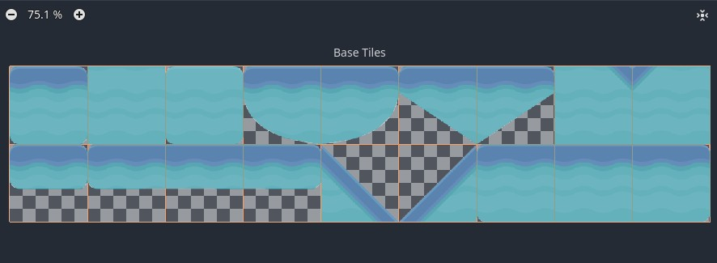
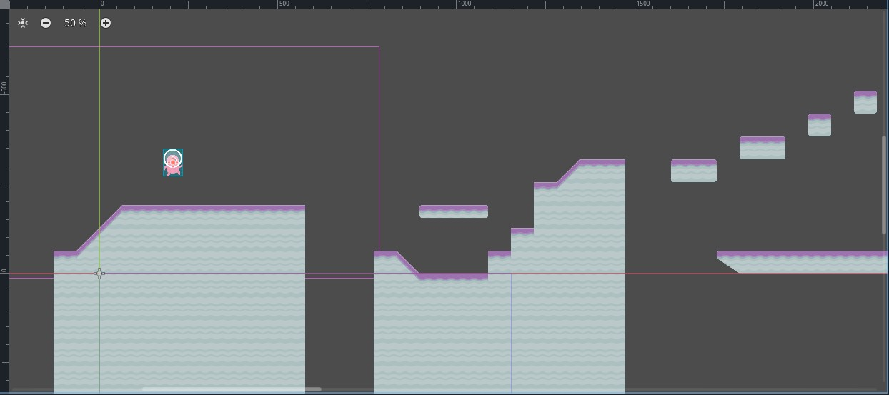
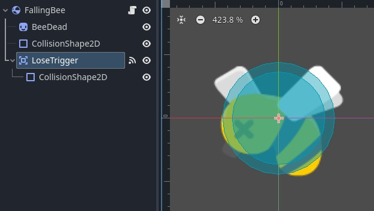
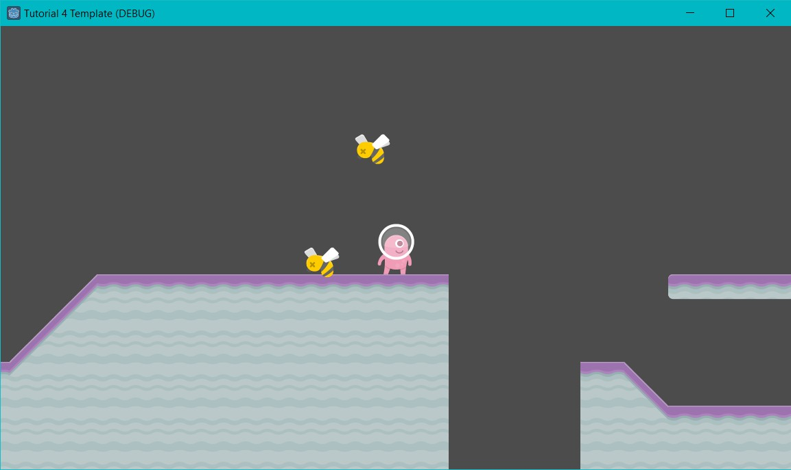
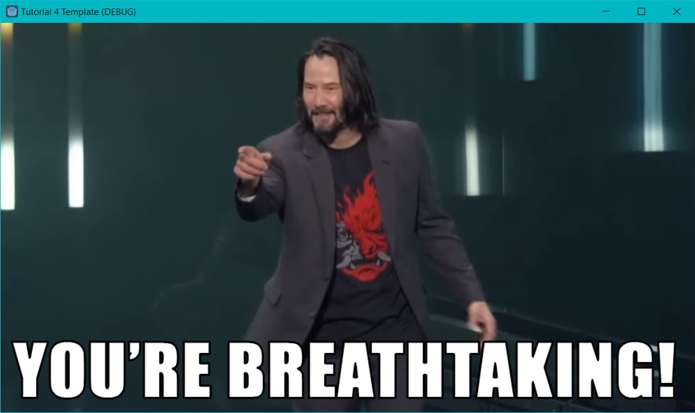
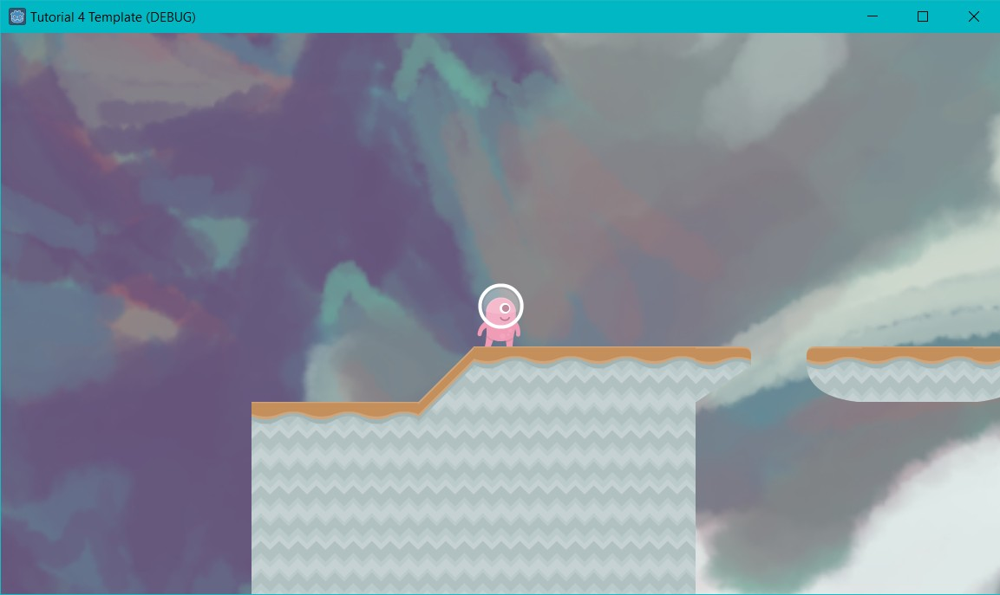

# Tutorial 4: Latihan Mandiri

Pada bagian latihan mandiri tutorial 4 ini, saya mendapat tugas untuk membuat level baru dengan tilemap dan obstacle berbeda. Berikut cara saya mengimplementasinya:

## Level Baru dengan Tilemap Baru

Untuk membuat level baru, saya membuat scene baru bernama `Level2.tscn`. Di scene ini saya membuat Node2D sebagai root nodenya dan menambahkan TileMapLayer sebagai child node pertama. Untuk mulai menggambarkan level 2 ini, saya mengimport `spritesheet_gr_planet.png` dari assets dan mengatur physics layer 0-nya dulu agar player bisa collide dengannya. 

Setelah selesai menggambarkan level 2, saya juga menarik `Player.tscn` dari folder scenes menjadi child dari root node level 2 saya agar level ini dapat dimainkan.

## Obstacle Baru

Untuk membuat obstacle baru, saya membuat scene baru bernama `FallingBee.tscn`. Di sini, root node yang saya pilih adalah RigidBody2D. Sebagai child dari root node ini, saya tambahkan Sprite2D, CollisionShape2D, dan Area2D. Sprite2D yang ada saya tambahkan PNG sprite `bee_dead.png` dari folder assets, kemudian saya juga atur CollisionShape2D-nya agar mengikuti bentuk lebah ini.

Untuk Area2D node, saya menggunakannya sebagai trigger untuk kalah-nya pemain, sehingga saya tambahkan juga child node CollisionShape2D pada Area2D ini dan membuatnya sedikit lebih besar dari CollisionShape2D lebahnya sendiri. 

Untuk mengatur kondisi kalah, saya mengambil signal body_entered() dari Area2D yang tadi sudah saya jadikan child node dan saya sambungkan ke fungsi `_on_lose_trigger_body_entered()` pada script FallingBee.gd. Setelah saya mengatur fungsi ini untuk change scene ke LoseScreen saat body yang dideteksi adalah Player body, saya sambungkan script ini ke FallingBee.tscn.

## Spawner

Untuk spawner di Level2, saya hanya menggunakan ulang spawner yang telah saya buat untuk Level1. Yang saya ubah hanya obstacle-nya dari `FallingFish.tscn` menjadi `FallingBee.tscn`.

## Integrasi dengan Level 1

Agar Level 2 dapat diintegrasikan dengan Level 1, saya mengganti scene trigger di winning condition Level 1 agar mengganti scene menjadi Level2 dan bukan WinScreen. WinScreen baru dapat dicapai saat player mencapai winning condition di Level 2.

## Polishing

Untuk polishing tambahan, saya hanya menambahkan background hasil karya saya sendiri pada kedua level dengan menambahkan child node `TextureRect` pada keduanya.

*Referensi: https://csui-game-development.github.io/tutorials/tutorial-4/*