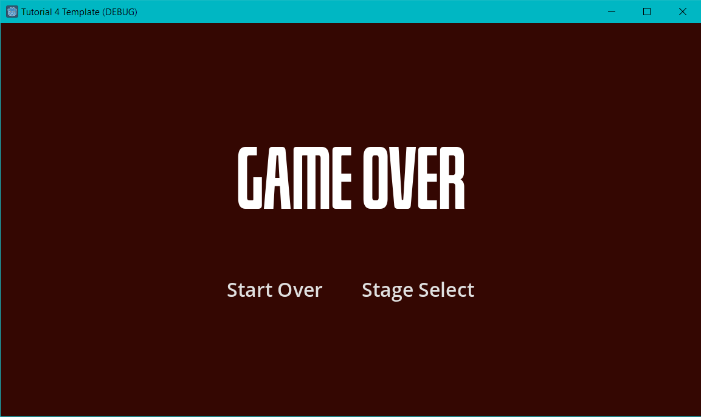
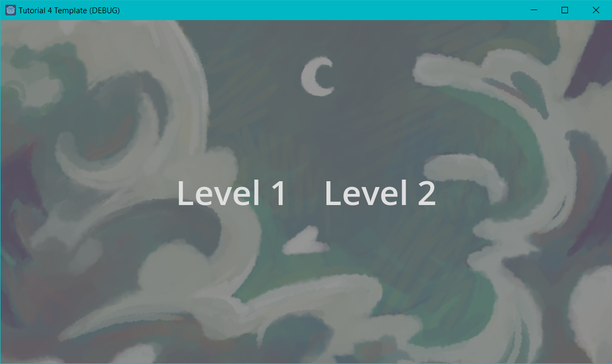
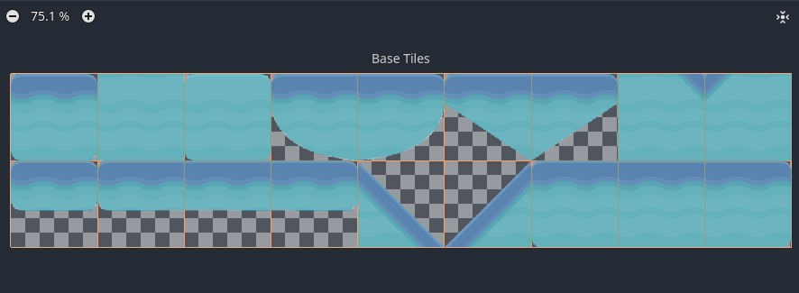
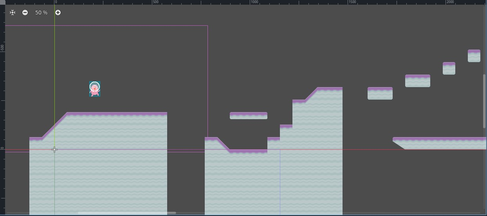
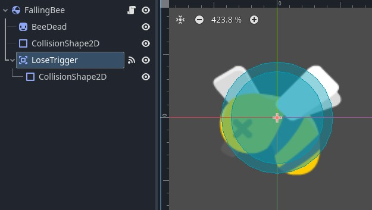
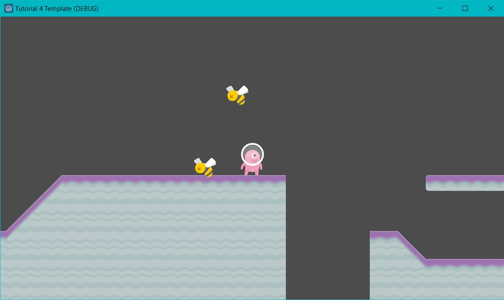
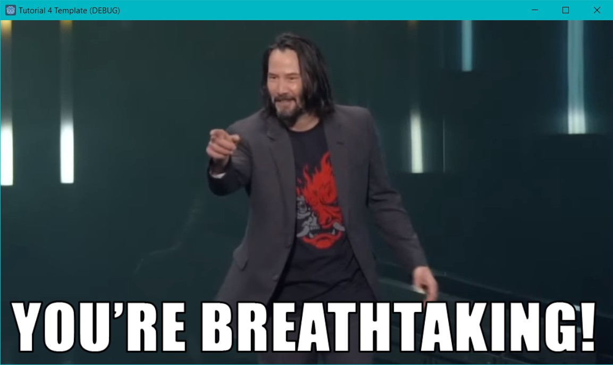
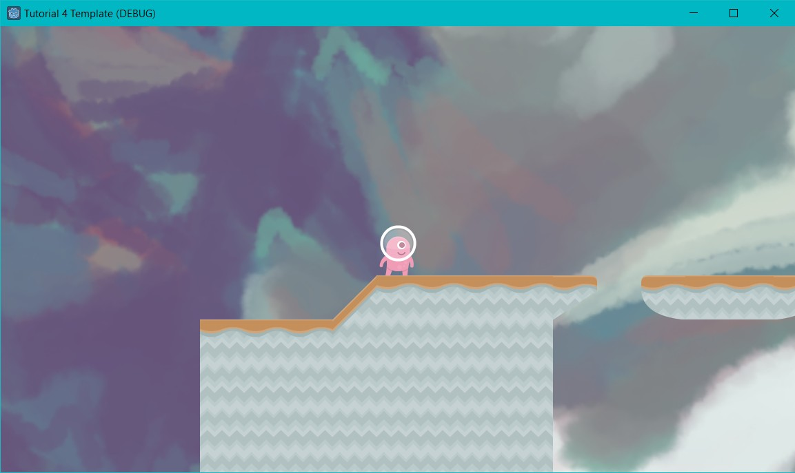

# Tutorial 6: Latihan Mandiri

Reference: https://csui-game-development.github.io/tutorials/tutorial-6/

## 1. Tombol pada layar game over untuk kembali ke menu utama.
To implement this feature, I added an HBoxContainer in the GameOver scene with 2 Link Buttons: StartOver and StageSelect. Both of these Link Buttons used the same script, `GameButton.gd`. The script is as seen below:

```
extends LinkButton

@export var scene_to_load : String
# Called when the node enters the scene tree for the first time.
func _on_pressed():
	get_tree().change_scene_to_file(str("res://scenes/" + scene_to_load + ".tscn"))
```



For the StartOver button, I just set the scene to MainMenu, while for the StageSelect Button, I set the scene to StageSelect. Other than this, I also added a GameOver.gd script in the root node of the GameOver scene like so:

```
extends ColorRect

# Called when the node enters the scene tree for the first time.
func _ready() -> void:
	Global.lives = 3
```

This is to reset the player's lives back to 3 after they lose.

## 2. Fitur Select Stage
To implement the select stage screen, I just added a new scene called StageSelect with a MarginContainer as its root node.

This scene has a texture rect for its background and an HBoxContainer with two link buttons to select between Level1 and Level2. These buttons were attached to the same script as the one mentioned in the GameOver scene but set to point to its respective levels.



After I was done with that, I just made the select stage button in the main menu and in the game over screen point to this StageSelect scene.


# Tutorial 4: Latihan Mandiri

Pada bagian latihan mandiri tutorial 4 ini, saya mendapat tugas untuk membuat level baru dengan tilemap dan obstacle berbeda. Berikut cara saya mengimplementasinya:

## Level Baru dengan Tilemap Baru

Untuk membuat level baru, saya membuat scene baru bernama `Level2.tscn`. Di scene ini saya membuat Node2D sebagai root nodenya dan menambahkan TileMapLayer sebagai child node pertama. Untuk mulai menggambarkan level 2 ini, saya mengimport `spritesheet_gr_planet.png` dari assets dan mengatur physics layer 0-nya dulu agar player bisa collide dengannya. 



Setelah selesai menggambarkan level 2, saya juga menarik `Player.tscn` dari folder scenes menjadi child dari root node level 2 saya agar level ini dapat dimainkan.




## Obstacle Baru

Untuk membuat obstacle baru, saya membuat scene baru bernama `FallingBee.tscn`. Di sini, root node yang saya pilih adalah RigidBody2D. Sebagai child dari root node ini, saya tambahkan Sprite2D, CollisionShape2D, dan Area2D. Sprite2D yang ada saya tambahkan PNG sprite `bee_dead.png` dari folder assets, kemudian saya juga atur CollisionShape2D-nya agar mengikuti bentuk lebah ini.

Untuk Area2D node, saya menggunakannya sebagai trigger untuk kalah-nya pemain, sehingga saya tambahkan juga child node CollisionShape2D pada Area2D ini dan membuatnya sedikit lebih besar dari CollisionShape2D lebahnya sendiri. 



Untuk mengatur kondisi kalah, saya mengambil signal body_entered() dari Area2D yang tadi sudah saya jadikan child node dan saya sambungkan ke fungsi `_on_lose_trigger_body_entered()` pada script FallingBee.gd. Setelah saya mengatur fungsi ini untuk change scene ke LoseScreen saat body yang dideteksi adalah Player body, saya sambungkan script ini ke FallingBee.tscn.


## Spawner

Untuk spawner di Level2, saya hanya menggunakan ulang spawner yang telah saya buat untuk Level1. Yang saya ubah hanya obstacle-nya dari `FallingFish.tscn` menjadi `FallingBee.tscn`.




## Integrasi dengan Level 1

Agar Level 2 dapat diintegrasikan dengan Level 1, saya mengganti scene trigger di winning condition Level 1 agar mengganti scene menjadi Level2 dan bukan WinScreen. WinScreen baru dapat dicapai saat player mencapai winning condition di Level 2.




## Polishing

Untuk polishing tambahan, saya hanya menambahkan background hasil karya saya sendiri pada kedua level dengan menambahkan child node `TextureRect` pada keduanya.




*Referensi: https://csui-game-development.github.io/tutorials/tutorial-4/*